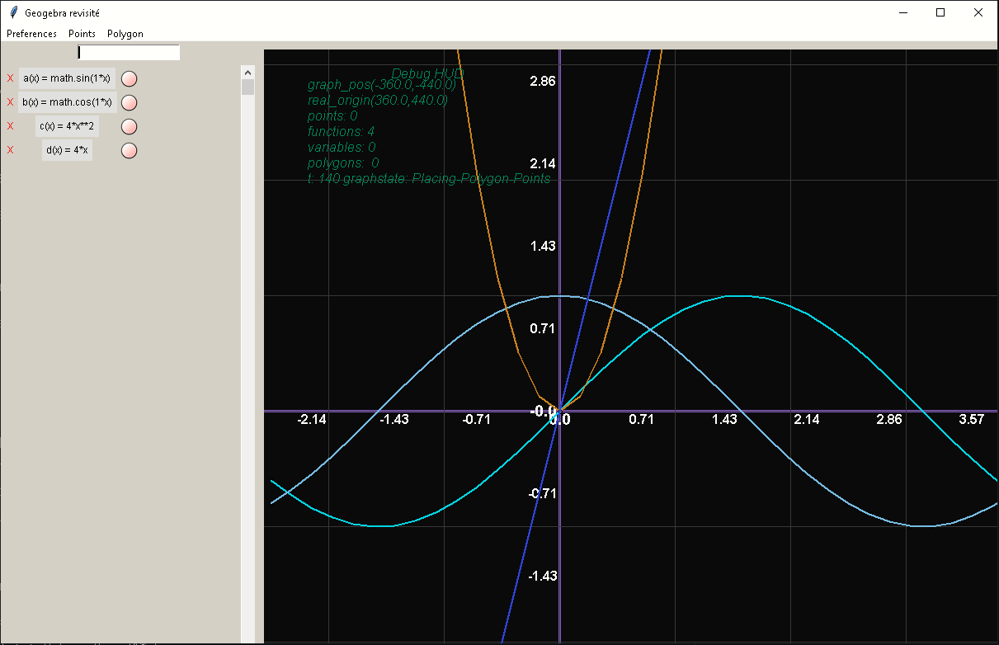
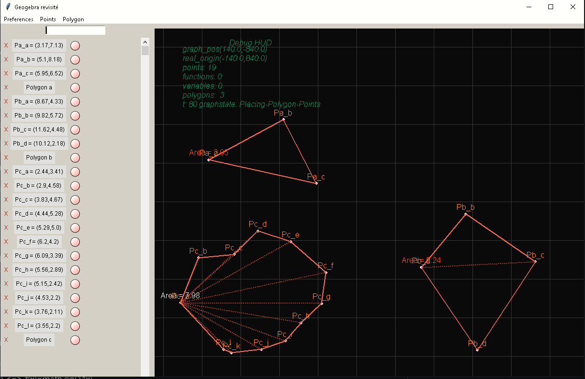
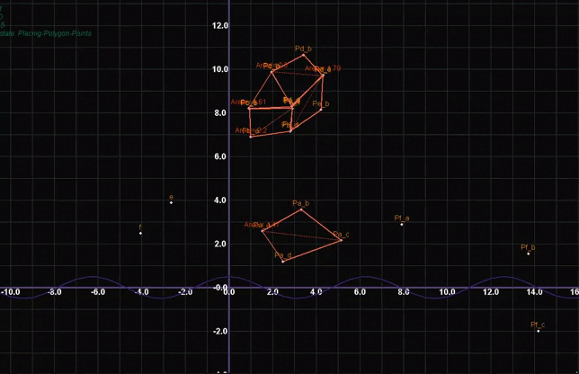
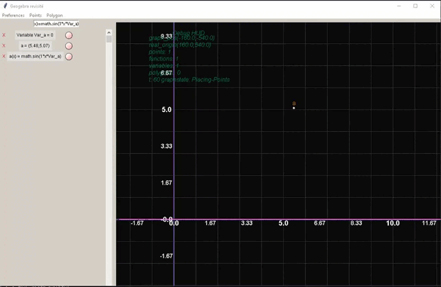

## Geogebra-Remake (projet lycée)

Ceci est un remake du projet Geogebra en Python.

### Fonctionnalités
 
 
- Affichage de la courbe représentative d'une fonction.

- Création d'un Polygone et calcul de son aire.

- Projection et rotation 3D des points.

 

- Variable sous forme de curseur modifiable.

 

 
### Controles:
- zqsd: Déplacer le repère
- e/r : Zoom et Dezoom
- ijkl: Test de repère en 3D (inutile)
- c, v, b : Rotation des points dans 3 axes différents
- n : Reset des angles.

### Formalisme des fonctions:
- f(x)=x      <=> f(x)=1*x
- f(x)=sin(x) <=> f(x)=math.sin(1*x)
- f(x)=x²     <=> f(x)=x**2
- f(x)=4x²+3x^3+sin(x)+log(x) <=> f(x)= 4*x**2+3*x**3+math.sin(1*x)+numpy.log(1*x)

 
 

